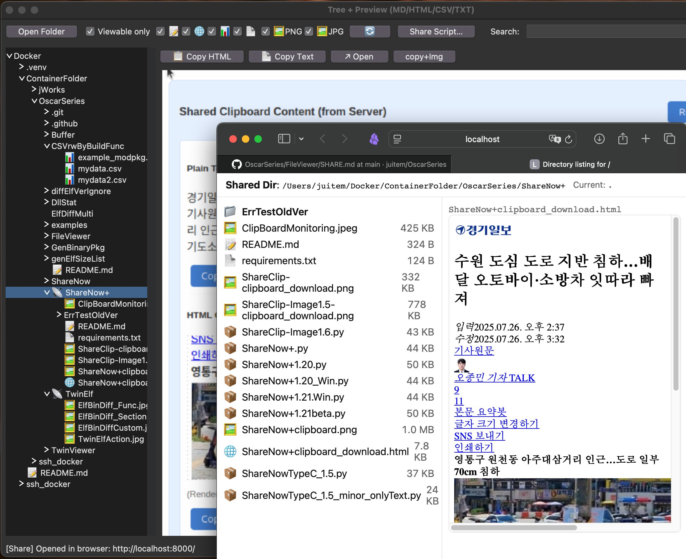

# File Viewer + Sharer

- rFileViewer(can launch sharer): A simple file viewer for displaying and sharing files in a web application.
- rFileSharer: A file sharing feature that allows users to view/share files with others.





----------

# rFileViewer — Tree + Preview (Markdown / HTML / CSV / TXT / Images)

This document summarizes the features and usage of `rFileViewer.py`.

---
## Key Features
- **Left Tree / Right Preview** layout
  - The tree expands quickly with **lazy loading**
  - **Directories are always shown**, files are toggled based on filter conditions
- **Top Toolbar**
  - **Open Folder**: Open a different starting directory
  - **Viewable only**: Show only viewable files (directories remain visible)
  - **Toggle by Extension**: 📝(MD), 🌐(HTML), 📊(CSV), 📄(TXT), 🖼️PNG, 🖼️JPG
  - **🔄 Refresh**: Refresh contents of the current (selected/root) directory only
  - **Share Script…**: Select a custom share script to use instead of `share.py`
  - **Search**: Filter based on **regular expressions** (case-insensitive)
- **File Preview (Right)**
  - **Markdown**: Convert to HTML using `markdown2` (preferred) or `python-markdown`, supports tables/code blocks
  - **HTML**: Render as-is (if partial fragment, wrap in a document for display), supports loading relative resources
  - **CSV**: Render as an HTML table (default limit: **up to 2,000 rows × 200 columns**)
  - **TXT**: Safely displayed inside `<pre>`
  - **Images**: Preview PNG/JPG/JPEG (load files via `file://` URL)
  - **If HtmlFrame is unavailable**, display **source in Text widget** (read-only guaranteed)
- **Copy/Open Tools (Top Right Toolbar & Context Menu)**
  - **Copy HTML / Copy Text**
  - **Copy as PNG (Data URL)**, **Copy as Bitmap** *(best effort per OS: Win/macOS/Linux)*
  - **Copy as Markdown / Copy as TXT** (source-based)
  - **Select All** (only in Text fallback for full selection)
  - **↗ Open**: Open file with system default application
- **Sharing (integrated with share.py)**
  - Right-click **directory in tree** → **Share On… / Share Off / Open Browser**
  - Shared folders show a **📡 icon** on the tree label
  - The **Share Script…** button allows replacing the script to run (default: `share.py` in the same folder)
- **Port Suggestion & Validation**
  - When starting sharing, automatically suggest a default port by searching for a **free port starting from last used port +1**
  - If the user inputs a port **already in use**, execution is blocked
  - Initial suggestion is **8000** (internal default 7999 → +1)
- **Exit Behavior (Cleaning up Sharing Processes)**
  - `--kill-on-terminate {true,false,ask}` (default **ask**)
    - `true`: Always terminate the sharing server on exit
    - `false`: Keep the sharing server running on exit
    - `ask`: Show a confirmation dialog **only if there is at least one shared folder** → terminate if Yes is selected
  - Closing the window (X), **Ctrl+C / SIGINT / SIGTERM** all apply the same policy
  - (POSIX) Sharing processes are launched in a **new session** to improve termination stability

---
## Usage
```bash
python3 rFileViewer.py [PATH] \
  -d, --start-dir DIR        # Starting directory (can be used instead of PATH) \
  -s, --search REGEX         # Regular expression search to apply immediately on launch \
      --view-alltype         # Show all file types at start (disable Viewable only) \
      --kill-on-terminate {true,false,ask}  # Sharing server handling policy on exit (default: ask)
```

---------


with open("/mnt/data/test.md", "w", encoding="utf-8") as f:
    f.write("""# Features of `share.py`

The `share.py` script is a **simple HTTP-based directory sharing tool** with a built-in file browser.  
Here are its key features:

## 📂 Directory Sharing
- Serves any given directory over HTTP with `python share.py /path/to/dir -p 8000`.
- Supports configurable port via `-p` / `--port` (default: `8000`).
- Ensures safe navigation by restricting access to the specified root directory.

## 🗂️ Directory Listing (Tree View)
- Displays a **two-pane UI**:
  - **Left pane**: directory tree (folders first, sorted alphabetically).
  - **Right pane**: file preview area.
- Uses emojis/icons to represent file types:
  - 📁 Directory
  - 📝 Markdown
  - 🌐 HTML
  - 📊 CSV
  - 📄 Text
  - 🖼️ Image
  - 📦 Other files

## 🔎 File Preview Support
- **Markdown (`.md`, `.mdx`, `.markdown`)**:
  - Rendered to HTML using `markdown2` or `python-markdown`.
  - If both fail, falls back to raw `<pre>` text.
- **HTML (`.html`, `.htm`)**:
  - Displayed inside an `<iframe>`.
- **Images (`.png`, `.jpg`, `.jpeg`, `.gif`, `.webp`, `.bmp`, `.tiff`)**:
  - Displayed with proper scaling and border styling.
- **CSV (`.csv`)**:
  - Rendered as a styled HTML table.
- **Text (`.txt`)**:
  - Displayed inside a `<pre>` block.

## 📥 File Operations (Context Menu)
- Right-click on a file in the tree opens a **custom context menu** with options:
  - **Download** → via `/__api/download?p=...` (forces `Content-Disposition: attachment`).
  - **Copy link** → copies the encoded file URL to clipboard.
  - **Save as…** → triggers browser “Save As” dialog using `<a download>`.

## ⚙️ API Endpoints
- `GET /__api/list?p=path` → returns JSON with directory entries.
- `GET /__api/render_md?p=path` → returns rendered Markdown HTML + engine info.
- `GET /__api/download?p=path` → returns file as attachment with proper MIME type.

## 🛡️ Security
- Implements `_safe_join` to ensure all paths remain inside the shared root.
- Uses `Access-Control-Allow-Origin: *` for convenient cross-origin preview.

## 🎨 UI Styling
- Clean modern CSS with flex layout.
- Responsive two-pane interface with context menu.
- Styled tables, pre blocks, and Markdown output.

---

✅ In summary, `share.py` is a **portable mini file server** with a **rich in-browser file explorer**, supporting previews for Markdown, HTML, CSV, text, and images, along with secure file downloads.
""")